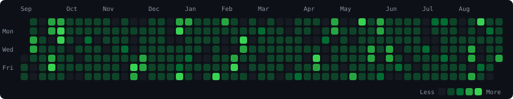
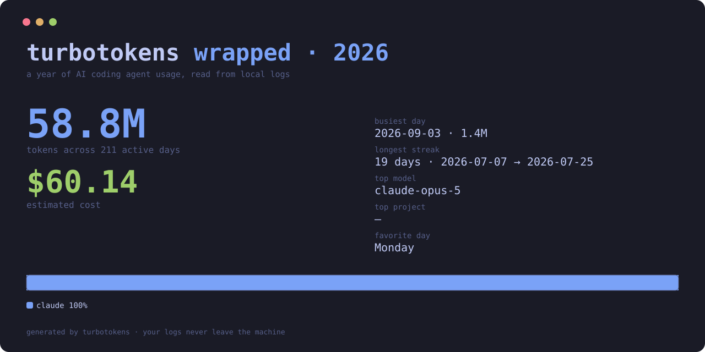

# turbotokens

Real-time token and cost telemetry for AI coding agents. Single Rust binary, no runtime.

[](https://github.com/maxmoneycash/turbotokens/releases)
[](#how-it-compares)
[](#how-it-compares)
[](#development)

AI coding agents write every token they use into local JSONL logs. turbotokens reads those logs in place — nothing uploaded, no config — and turns them into cost reports, a live dashboard, plan-limit tracking, budget alerts, and metrics. It supports 18 agents: Claude Code, Codex, OpenCode, Amp, Gemini, Copilot, Kimi, Grok Build, Qwen, Droid, Codebuff, Hermes, Goose, Kilo, OpenClaw, pi-agent, Antigravity, and ZCode.


## Install

```bash
brew install maxmoneycash/tap/turbotokens   # macOS / Linux (Homebrew)
npx turbotokens                             # anywhere with Node
```

Or the shell installer:

```bash
curl -fsSL https://raw.githubusercontent.com/maxmoneycash/turbotokens/main/install.sh | sh
```

Prebuilt binaries for macOS (arm64/x64), Linux (x64/arm64), and Windows (x64/arm64) are on the [Releases](https://github.com/maxmoneycash/turbotokens/releases) page. Or build from source: `cargo install --path rust/crates/turbotokens --features fetch-litellm-pricing`.

## Usage

`turbotokens` with no arguments prints a daily cost report across every agent it detects on your machine. From there, everything is a subcommand:

| Command | What it does |
| --- | --- |
| `turbotokens daily` / `weekly` / `monthly` / `session` | Cost reports grouped by day, week, month, or session |
| `turbotokens blocks` | Usage per 5-hour billing window |
| `turbotokens limits` | Plan-limit / quota tracking (Claude, Codex) — 5-hour and weekly window utilization and reset times |
| `turbotokens import <file>` | Render a ccusage JSON export (`ccusage daily --json` etc.) as a native turbotokens report — no log re-reading |
| `turbotokens heatmap` | GitHub-style heatmap of tokens (or `--cost`) per day for the last year; `--svg out.svg` writes a shareable image |
| `turbotokens wrapped` | Year-in-review card — totals, busiest day, longest streak, top model/project, per-agent split; `--year 2025`, `--svg card.svg` |
| `turbotokens claude daily` | The same reports for one agent — every agent has its own subcommand (`codex`, `opencode`, `gemini`, `grok`, …) |
| `turbotokens live` | Real-time dashboard: today's spend, 5-minute burn rate, model share, active sessions, and every event as it lands |
| `turbotokens live --agent codex` | Live dashboard for a different agent |
| `turbotokens daemon start` | Resident index process — reports answer in under a millisecond from then on |
| `turbotokens doctor` | Shows what data it sees, cache health, and pricing coverage |

Useful flags, on every report: `--json` for piping, `--since` / `--until YYYYMMDD` for date ranges, `--breakdown` for per-model costs, `--watch` to auto-refresh as logs change.


## Shareable stats

`turbotokens heatmap --svg heatmap.svg` and `turbotokens wrapped --svg wrapped.svg` turn your year into images worth posting:





## Live dashboard

`turbotokens live` watches the log files directly — new usage hits the screen about 100 ms after the agent writes it. It's also the integration point:

```bash
# Stream every event as JSON
turbotokens live --json | jq -r 'select(.type=="usage") | .cost'

# Webhook alert when today gets expensive
turbotokens live --alert-cost 25 --webhook https://hooks.slack.com/...

# Prometheus metrics for Grafana
turbotokens live --serve 127.0.0.1:9090
```

## How it compares

The benchmark above ([harness](rust/bench/scaling-bench.sh), identical logs, byte-identical counts) covers one cold scan. Everything else people actually hit:

| | turbotokens | ccusage | tokscale | token-monitor | claude-code-usage-monitor | Menu-bar apps |
| --- | --- | --- | --- | --- | --- | --- |
| What it is | Single Rust binary | Rust binary (npx/bunx wrapper) | Rust CLI + TUI | Desktop widget (JS) | Python CLI | Native macOS apps |
| Agents covered | **18** | 18 | 45+ | 32+ | 1 | 1–2 |
| Real 2.3 GB / 1,648-file folder, cold | **170 ms** | 6–8.5 s | — | — | — | — |
| Same folder, warm | **10 ms** | re-parses every run | cached | — | — | — |
| Resident daemon (<1 ms reports) | Yes | No | No | No | No | No |
| Real-time event stream | Yes, ~110 ms | Active-block monitor only | No | Yes, live widget | Yes, Claude only | Yes |
| Budget alerts / webhooks | Yes | No | No | Plan-limit tracking | Limit warnings | Notifications only |
| Prometheus endpoint | Yes | No | No | No | No | No |
| Pipeable JSON | Yes | Yes | Yes | — | No | No |
| Your data leaves the machine | Never | No | Optional public leaderboards | Optional device sync | No | No |

tokscale is the closest peer — Rust core, the broadest agent coverage, and a social leaderboard (which means uploading your usage if you opt in). token-monitor is a different niche: an always-on desktop widget that also tracks provider plan limits. turbotokens' niche is scripted reporting and integration: the fastest cold/warm reports, a real event stream, and alerts/metrics/JSON that plug into anything.

## In production

Measured swapping turbotokens into a real accounting pipeline over **68.2B tokens** of agent logs (9 agents, 68 models):

| | ccusage | turbotokens |
| --- | --- | --- |
| Usage scan | 30+ min | **14 s** |
| Full pipeline collection | 45+ min | **2m 13s** |
| Tokens found | 67.4B | **68.2B** (+785M it missed) |
| Codex token accuracy | double-counts `token_count` events (+10.16B tokens over-reported) | matches an independent raw-log parser to 0.0001% |

Pricing coverage mattered as much as speed: models ccusage priced at $0 — including 686M tokens of k3 and 397M of grok-4.6 — come back priced, $16.9K of previously-invisible spend on this dataset. Reported cost lands within 2.3% of list value instead of 28% short.

## Diagnostics

Real `turbotokens doctor` output on a working machine:

```bash
$ turbotokens doctor
✓ version: 1.0.1
✓ claude data: ~/.claude (1648 JSONL files, 2.3 GB)
✓ codex data: ~/.codex/sessions (2179 JSONL files)
✓ other agents: 3 other agents detected (opencode, gemini, grok)
✓ parse cache: 3307 entries, 58.5 MB
✓ embedded pricing: loadable (468 models)
```

One command tells you what turbotokens sees, what's healthy, and what to fix. Shell completions included: `turbotokens completions zsh`.

## Development

```bash
cd rust
cargo build --release --bin turbotokens --features fetch-litellm-pricing
cargo test --workspace --features fetch-litellm-pricing

bench/warm-bench.sh 10     # warm-vs-uncached median + byte-parity check
bench/latency-probe.sh 20  # live-mode end-to-end latency, p50/p95
```

## License

MIT — see [LICENSE](LICENSE).

turbotokens began as a fork of [ccusage](https://github.com/ccusage/ccusage)
by [@ryoppippi](https://github.com/ryoppippi), and is a substantial rewrite of
it. The original MIT copyright is preserved in `LICENSE` alongside the new
work's. ccusage appears in the comparison table above as the tool most people
are choosing between — the benchmarks there are measured, and the lineage is
this one.
